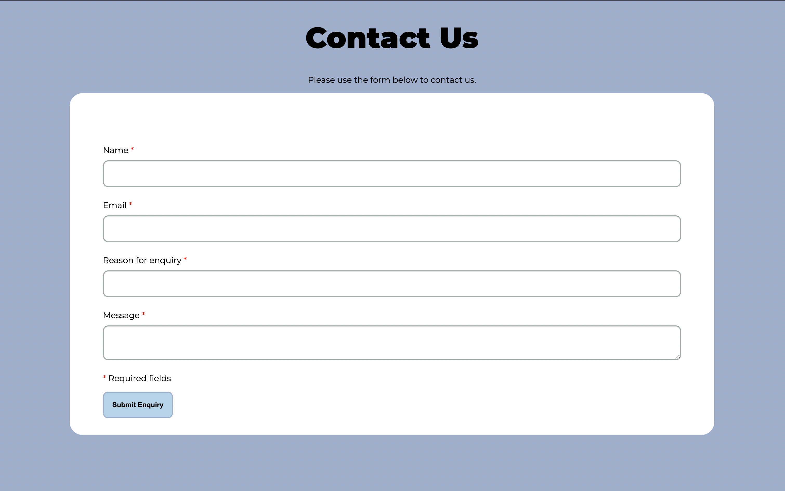
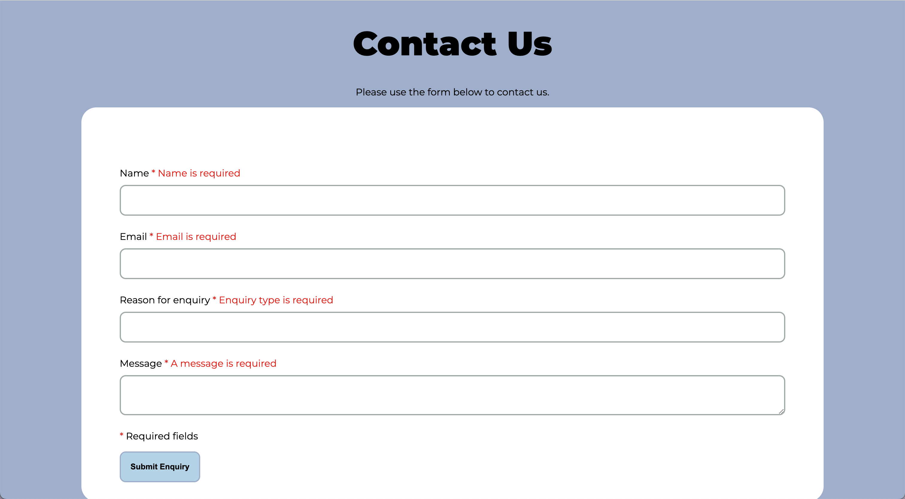
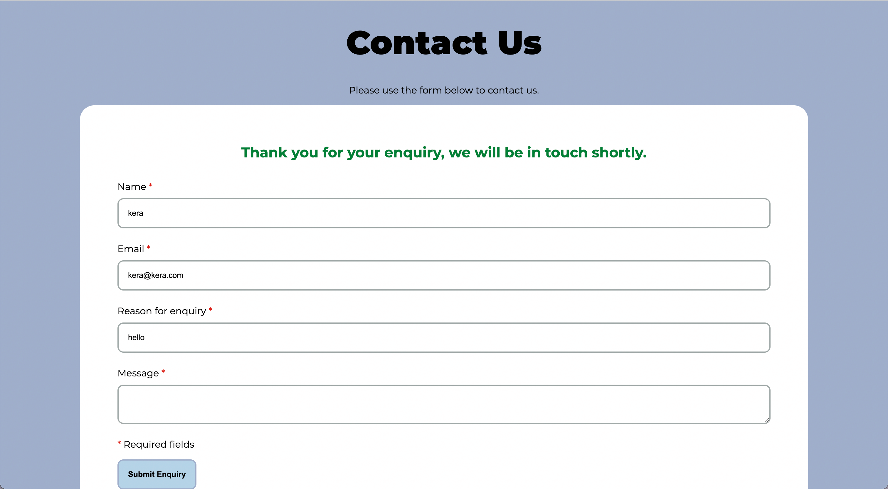

# PHP Contact Form

Developer Advocate task for SWGfL interview for Junior Web Developer Position.

## Task Instructions

Produce a simple PHP Script that does the following:

* Presents an HTML form for the user to enter their:
  * Name
  * Email Address
  * Reason for Enquiry
  * Message

* Receive form input and:
  * Validate input
  * Display appropriate error messages
  * Send the entered information in an email

* Requirements
  * Build in PHP/HTML/CSS
  * Use all your own code - no libraries
  * All be in one script

* If you have time:
  * Make the page look nice

* Doesn't have to be:
  * Be class based
  * Use functions
  * Be in anymore than one file
    * An inline CSS script is fine if you get to that
  * Working (with regards to sending the email) / finished or perfect

* Once finished please email your script to us
  * It doesn't need to be uploaded to a server to show working

- - -
## What I've Learnt

As I had no experience with PHP, I watched several Youtube tutorials, researched the web for articles and tutorials and referenced the PHP Documentation to complete this task. I have included below some of the things I have learnt whilst completing this task.

### **Using PHP.**

To enable me to view the contact page, I downloaded and am using XAMPP - this allows me to view the page I am creating on a local web server on my computer.

In my research I saw that there are two ways to add PHP to a site. The preferred way would be to create seperate PHP files for each part of the site, for example headers, footers, form validation etc. I have added the PHP to the HTML as the task instructed to use one script file.

### **Sending the entered information from a form through email.**

While researching this I found that there is an in built function in PHP to achieve this - mail(). 

The mail() function has 3 required arguments: who the mail is to be sent to, the subject of the email and the body of the email. 

I have chosen to also include the optional argument of headers to include the users email in the from field.

### **Validating a form using PHP.**

There are a number of different ways to complete validation of a form using PHP, however as a beginner to using PHP I have chosen to use a method that I best understood. This method uses if else loops to check whether the field from the form has been filled out - if the field is empty it will display an error message. If the field is filled out that value will be assigned to a variable which can then be used when sending the email.

In my research I did see a PHP function filter_var($email, FILTER_VALIDATE_EMAIL) which can be used to check whether an email is well formed. I have not included this in my code, but plan to learn how to implement it in the future.

### **Displaying Error Messages.**

An if else loop is used to validate the form. If a field is empty it will trigger an error message to display on the form. 

I have used the PHP function isset() to check whether a field has been filled out and saved to a variable. If it has then the variable will be echoed into the input. This prevents a user having to retype all inputs on the field if they haven't filled out all required fields. The Value attribute cannot be used on a textarea so this is the only field that doesn't include this. 

### **Displaying a Success Message.**

To display a success message I am checking that each of the input variables are set with isset. If all variables contain data - the success message will be echoed.

- - -
## Resources used

* Git - For version control.
* GitHub - To save and store code.
* Visual Studio Code - IDE.
* [XAMPP](https://www.apachefriends.org/index.html) - To allow me to build and view the project on a local web server on my computer.
* [PHP Code Checker](https://phpcodechecker.com/) - used to check there were no errors in my PHP code.
* [PHP Official Documentation]() - For reference
* Various YouTube videos and web articles/tutorials for research